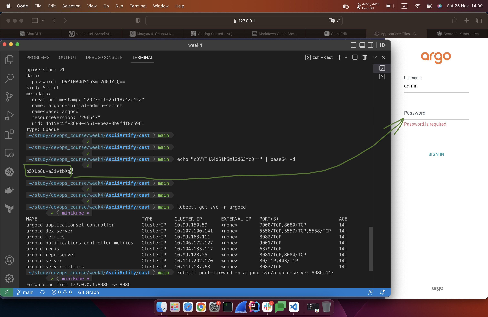

# ArgoCD: installation and GUI access

## Official Documentation:
Please find ArgoCD Quickstart guide via https://argo-cd.readthedocs.io/en/stable/getting_started/

## Quickstart installation guide:

Create a new namespace for ArgoCD and apply Kubernetes YAML file:

`kubectl  create  namespace  argocd`

Apply the following k8s yaml file in order to install ArgoCD:

`kubectl  apply  -n  argocd  -f  https://raw.githubusercontent.com/argoproj/argo-cd/stable/manifests/install.yaml`

**Please note:** It is *ALWAYS* better to check .yaml before you apply it. Download the .yaml file locally, inspect it, edit if necessary and apply using `kubectl apply -n argocd install.yaml`

Check pods status using `kubectl get pods -n argocd`, all pods should be in the RUNNING state.

## Accessing the ArgoCD GUI

Please refer to the following guide how to retrieve ArgoCD password and open/access the GUI

Now use decoded password (without `%` in the end of decoded string) to access GUI as it is shown in the screenshot below:

### Congratulations on initial ArgoCD setup, thanks for tuning in!
